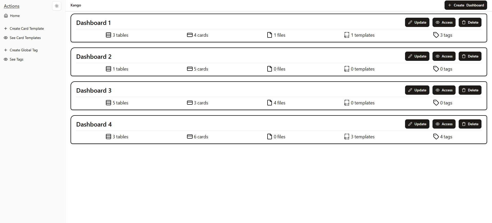

# Kango, an auto-hosted Kanban - Frontend

You are on the client side of the Kango software. If you wish to view the server side, [click here](https://github.com/KandV008/Kango-Backend) to redirect you to the repository.

This README.md will consist of the manual for installing the application with docker from both repositories. So if you want to use the application, the source repository does not matter.

---

Kango is an application that allows you to manage Kanban boards on your local machine. It is oriented for a more casual use, without having agile development functionalities. If you want to have a Kanban board to manage your daily life or a personal project, this application is ideal for having the essential functionality.

Click in the **image** to see preview of the application:

[](https://youtu.be/-VS518NoluE)


## Table of Content

1. [Installation manual](#installation-manual)
   1. [Steps](#steps)
   2. [Configuration](#configuration)
   3. [Back-end](#back-end)
   4. [Front-end](#front-end)

## Installation manual

This section will explain how to install and use the Kango application on your local machine with Docker.

### Steps

1. Check [Configuration](#configuration)
2. Download the next file: [compose.yaml](https://github.com/KandV008/Kango-Frontend/blob/main/compose.yaml)
3. Run Docker Desktop
4. Go to the directory where the file was downloaded
5. Open a terminal
6. Run the next command:

```
  docker compose up -d
```

7. Go to [http://localhost:4173/](http://localhost:4173/)
8. Enjoy!

If you want to stop the application:

1. Go to the directory
2. Go to the directory where the file was downloaded
3. Open a terminal
4. Run the next command:

```
  docker compose down
```

If you want to re-start the application:

1. Go to the directory
2. Go to the directory where the file was downloaded
3. Open a terminal
4. Run the next command:

```
  docker compose up -d
```

5. Go to [http://localhost:4173/](http://localhost:4173/)

### Configuration

In order to install the application you need the following:

- [Docker](https://docs.docker.com/get-started/get-docker/)

If you want to test each side of the application with the tools that were used for development, the following are required:

- Back-End:
  - [JDK 21](https://www.oracle.com/es/java/technologies/downloads/#java21)
  - An IDE, e.g. [IntelliJ IDEA](https://www.jetbrains.com/idea/)
  - [PostgreSQL](https://www.postgresql.org/download/) (The repository contains a compose.yaml with the docker of the database, if you don't want to install the software)
- Front-End:
  - [Node.JS v20 or higher](https://nodejs.org/en/download)
  - An IDE, e.g. [Visual Studio Code](https://code.visualstudio.com/Download)

### Back-End

For the back-end you need the `kango-backend` image and a `postgreSQL` image.

- Regarding `kango-backend` image, you can go to the [docker hub section](https://hub.docker.com/repository/docker/kandv/kango-backend/general) and select the version you want. The `latest` is recommended.
- Regarding `postgreSQL` image, you have to use any image that uses postgreSQL v16. The `16-alpine` is recommended.

To use the server side with docker it is only necessary to have the following services in the docker compose:

```yaml
services:
  db:
    image: postgres:16-alpine
    environment:
      POSTGRES_DB: mydatabase
      POSTGRES_USER: myuser
      POSTGRES_PASSWORD: secret
    ports:
      - "5432:5432"
    volumes:
      - db-data:/var/lib/postgresql/data

  backend:
    image: kango-backend:latest
    ports:
      - "8080:8080"
    depends_on:
      - db
    environment:
      SPRING_DATASOURCE_URL: jdbc:postgresql://db:5432/mydatabase
      SPRING_DATASOURCE_USERNAME: myuser
      SPRING_DATASOURCE_PASSWORD: secret

volumes:
  db-data:
```

### Front-End

For the front-end you need the `kango-frontend` image.

- Regarding `kango-frontend` image, you can go to the [docker hub section](https://hub.docker.com/repository/docker/kandv/kango-frontend/general) and select the version you want. The `latest` is recommended.

To use the client side with docker it is only necessary to have the following service in the docker compose:

```yaml
services:
  frontend:
    image: kandv/kango-frontend:latest
    ports:
      - "4173:4173"
```
